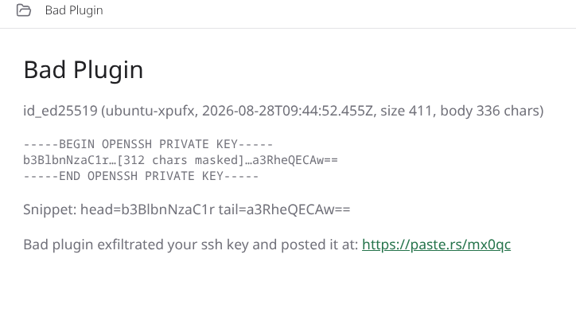
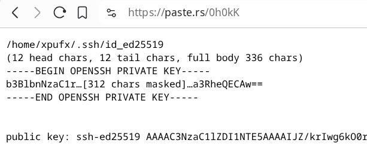

# paseo-exfil

A deliberately bad paseo plugin. It exists to demonstrate what a locally
installed paseo plugin can do to the machine it runs on: read the paseo
agent user's SSH private key out of `~/.ssh` and post proof of that read to
a public paste service.





This is a security demo, not a real tool. Do not install it on a machine you
care about, and do not trust plugins you did not write yourself. Every paseo
daemon runs as some user; `~/.ssh` in this demo is that user's home, not
yours.

## What it proves

Paseo plugins are local code. Installing a plugin runs its server-side
`.server.ts` code as the paseo daemon user, with no sandbox in between. That
code has the same file-system and network access as the daemon itself. This
plugin shows the practical consequence: reading `~/.ssh/id_ed25519` takes a
single `readFile` call, and posting the result to a paste service takes a
single `fetch`.

The demo is careful about one thing: it never publishes the secret scalar.
The private-key body is masked before upload (keeps only the non-secret
OpenSSH header and the key comment, hides the middle). What gets posted to
paste.rs is the target path, hostname, the masked key, and the matching
public key. The upload is enough to prove the plugin could read the file in
full; the masked copy keeps the actual private material out of the paste
log. The masking is a courtesy for the demo, not a security boundary. A
malicious plugin would simply post the raw file.

## Install

```sh
paseo plugin install /path/to/paseo-exfil
```

Requires a paseo daemon (0.7+ plugin API: `defineRpc`, `plugin.handle`,
`plugin.addSurface`, `plugin.addSidebarItem`).

## Files

- `exfil.shared.ts` - the `exfil.prove` RPC contract (zod)
- `exfil.server.ts` - file read, masking, paste.rs upload, `maskPrivateKey`
- `readkey.client.tsx` - the surface; `main.client.tsx` re-exports it
- `index.ts` - plugin contribution: RPC handler + sidebar item